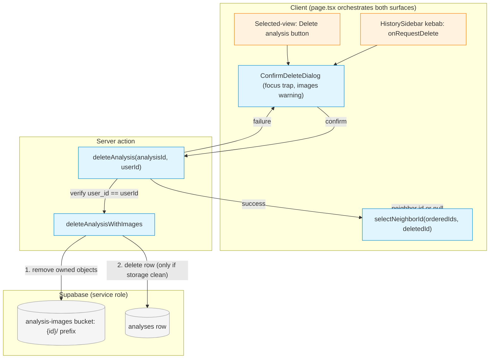

# Plan — Delete an analysis safely

**Complexity:** Complex (6-7 files; +1 from the security/authorization + irreversible-data-loss
multiplier over a base Medium file count)
**Risk:** Medium (well-trodden mechanics — RLS DELETE policy already exists, `cleanup-history.js`
already demonstrates the storage+DB delete — but the surface is a classic IDOR/BOLA + data-loss
path, so the authorization check and partial-failure semantics are load-bearing)
**Stack:** Next.js App Router + React + TypeScript + Supabase (react-ts pack)
**Evidence:** [HEURISTIC] — code-review-graph MCP unavailable; findings from grep + direct reads.

## Architecture

Three layers, following the existing `regenerateImages` shape end-to-end.

### 1. Server (authorization + destructive cleanup)
- **`app/lib/analytics-storage.ts` (modify)** — add `deleteAnalysisWithImages(analysisId, userId)`.
  Uses `getServerSupabase()` (service role). Steps:
  1. Fetch `id, user_id, image_paths` for `analysisId` (`.single()`).
  2. If not found → `{ success: false, error: "Analysis not found." }`.
  3. If `row.user_id !== userId` → `{ success: false, error: "Not authorized to delete this analysis." }`
     (verbatim the `regenerateImages` guard at actions.ts:231).
  4. Enumerate objects to remove: union of `image_paths` **and** a `storage.list("{analysisId}")`
     of the folder prefix (catches regeneration/orphan drift), then `storage.remove([...paths])`.
     `remove` is idempotent, so re-runs are safe.
  5. If storage removal reports any error → return failure (secret-free message), **DB row left
     intact** so the user can retry.
  6. Only then `.from("analyses").delete().eq("id", analysisId)`. If that errors → failure
     (storage already gone; a retry re-finds the row, no-ops the storage remove, retries the row
     delete — still safe).
  7. Return `{ success: true }`.
- **`app/app/actions.ts` (modify)** — add `deleteAnalysis(analysisId, userId): Promise<DeleteAnalysisResponse>`.
  `"use server"` action mirroring `regenerateImages`: guards `!userId`, wraps the helper in
  try/catch, returns `{ success, error? }`. This is the ONLY entry point the client calls.

### 2. Pure logic (post-delete view selection)
- **`app/lib/history-neighbor.ts` (create)** — `selectNeighborId(orderedIds: string[], deletedId: string): string | null`.
  Given the newest-first ordered id list and the deleted id, return the next-newer neighbor, else
  the next-older, else `null` (→ new-analysis state). Pure + unit-tested; keeps the view-selection
  rule out of the component and mechanically verifiable.

### 3. UI (two surfaces + one dialog)
- **`app/components/ConfirmDeleteDialog.tsx` (create)** — presentational modal. Props:
  `{ dateLabel, isDeleting, error, onConfirm, onCancel }` (a `preview` prop was cut post-Check per
  direct product feedback — see intent.md SC2 revision note). Responsibilities: `role="dialog"`
  + `aria-modal="true"` + accessible name; states images will be deleted; focus moves in on open,
  focus trap, Escape/backdrop cancel, focus restored to the opener on close; destructive confirm
  button visually distinct (design tokens). Shows `error` + keeps the dialog open for retry when a
  delete fails.
  - **Focus restoration fallback:** on open, capture `document.activeElement` (the opener) in a ref.
    On close (cancel OR successful delete), before calling `.focus()` on it, check
    `document.contains(openerEl)`. If the opener is still in the DOM (cancel, or error-retry close),
    restore focus there. If it's gone (the successful-delete case, where the sidebar entry — and its
    kebab button — no longer exists after the list refreshes), fall back to a `fallbackFocusRef`
    passed down from `page.tsx` (the sidebar's "New Analysis" button). Never leave focus on
    `<body>`.
- **`app/components/HistorySidebar.tsx` (modify)** — add a per-entry kebab button that calls a new
  `onRequestDelete(entry)` prop (does not itself confirm/delete — page owns orchestration). Add an
  `onEntriesChange(entries)` prop so the page can read the ordered list for neighbor selection
  without a second fetch. The existing single `listAnalyses()` fetch stays the source of truth; the
  page bumps `refreshTrigger` after a delete to re-fetch.
- **`app/app/page.tsx` (modify)** — owns the delete orchestration for BOTH surfaces:
  - Holds `pendingDelete: { id, dateLabel, preview } | null` and `deleteError`/`isDeleting`.
  - Renders `<ConfirmDeleteDialog>` when `pendingDelete` is set.
  - The sidebar kebab and a new "Delete analysis" button in the `viewing-history` view both set
    `pendingDelete`.
  - On confirm → `await deleteAnalysis(id, user.id)`. On success:
    - **If `id === selectedHistoryId`** (the deleted entry is the one currently open): compute
      `selectNeighborId(entryIds, id)`; if it returns an id, load that neighbor
      (`handleHistorySelect`); if `null`, call `handleNewAnalysis()`.
    - **Else** (deleted entry was not the one currently open, e.g. deleted via the sidebar kebab
      while viewing something else): leave `selectedHistoryId`/`historyViewData` untouched — do
      NOT navigate. The entry simply disappears from the sidebar list on refresh.
    - Always bump `historyRefreshTrigger`; announce via an `aria-live` region / existing toast.
    On failure: keep the dialog open with a support-safe `deleteError`.

### Tests
- **`app/lib/history-neighbor.test.ts` (create)** — neighbor selection: middle → newer, first →
  older, last-remaining → null.
- **`app/lib/analytics-storage.test.ts` (modify)** — `deleteAnalysisWithImages`: happy path removes
  storage + row; wrong-owner rejects and deletes nothing; storage failure leaves the row and reports
  failure. Uses the same Supabase-client mocking style already in the repo.

## Approach Decisions

### Decision: Dedicated server action vs. client-side anon delete via RLS
- **Alternative:** Delete client-side with the anon/browser client, relying on the existing DELETE
  RLS policy.
- **Pros:** No new server action; RLS already scopes to the owner.
- **Cons:** The anon client cannot reliably clean up storage — the `analysis-images` bucket is
  public-read with no anon delete policy, so images would orphan. The backlog explicitly requires
  "authenticated server-side deletion and storage cleanup, not only UI work."
- **Why not chosen:** It structurally cannot delete the owned storage objects, guaranteeing orphaned
  images and a false "deleted" state — the exact partial-cleanup failure this feature must prevent.

### Decision: Deletion order — storage first, then DB row
- **Alternative:** Delete the DB row first, then remove storage objects.
- **Pros:** The user-visible record disappears immediately.
- **Cons:** If storage removal fails after the row is gone, the images are orphaned with no record
  left to retry from — the user sees "deleted" while owned objects persist in the bucket
  indefinitely, unreachable from the UI.
- **Why not chosen:** It makes a partial failure unrecoverable and reports success while cleanup is
  incomplete, violating SC4/SC5. Storage-first + idempotent `remove` keeps every retry safe because
  the row still points at the objects until both stores are clean.

### Decision: Page-level orchestration with sidebar reporting entries up
- **Alternative:** Let `HistorySidebar` own the whole delete flow (confirm dialog + action + neighbor
  selection) internally.
- **Pros:** Sidebar already holds the ordered entries list.
- **Cons:** The delete action also exists in the selected-analysis view (page-owned state:
  `selectedHistoryId`, `historyViewData`, `historyRefreshTrigger`). Duplicating the flow in the
  sidebar would fork neighbor/selection logic across two components and desync the selected view.
- **Why not chosen:** Two delete surfaces must drive one selection state; centralizing in `page.tsx`
  (sidebar reports its list up via `onEntriesChange`) keeps a single source of truth and one code
  path, at the cost of two thin new props on the sidebar.

## Blast Radius — delete-analysis-safely

```
Direct impact:
  app/lib/analytics-storage.ts   (modify: add deleteAnalysisWithImages) → used by actions.ts
  app/app/actions.ts             (modify: add deleteAnalysis action)     → used by page.tsx
  app/lib/history-neighbor.ts    (create: selectNeighborId)              → used by page.tsx + test
  app/components/ConfirmDeleteDialog.tsx (create)                        → used by page.tsx
  app/components/HistorySidebar.tsx (modify: kebab + onRequestDelete + onEntriesChange)
                                                                          → used by page.tsx
  app/app/page.tsx               (modify: orchestrate delete + dialog + neighbor + announce)
                                                                          → route root, no consumers

Transitive impact:
  page.tsx is the App Router page (route root) — no downstream importers.
  HistorySidebar is imported ONLY by page.tsx (grep-confirmed) — safe to extend props.
  New props on HistorySidebar are optional/additive → existing call site keeps compiling.

Risk areas:
  analytics-storage.ts has an existing vitest suite (appendImageGenerationState) → extend it;
    deleteAnalysisWithImages is the only new server-side unit needing coverage.
  page.tsx delete orchestration is UI glue → covered by manual scenarios (no page-level test harness
    exists today; components use RTL selectively). Neighbor logic extracted to a pure, tested util.
  No DB schema change (DELETE RLS policy already present, migration 20250215100000 lines 38-42).

Architectural compliance:
  ✅ Server action + service-role pattern mirrors regenerateImages (explicit user_id check).
  ✅ Storage remove + row delete mirrors scripts/cleanup-history.js (proven pattern).
  ✅ Design-token styling; functional components + hooks; TS interfaces for props.
  ⚠️ Ownership still trusts client-supplied userId (project-wide existing debt) — consistent with
     all current actions; NOT expanded here, noted in intent Constraints.
```

## Security Impact

```
app/app/actions.ts (deleteAnalysis) → HIGH (authorization + irreversible data destruction)
  Reachable from: authenticated client (page.tsx delete surfaces) — exposure: AUTHENTICATED
  Risk: IDOR/BOLA — without the ownership check, any authenticated user could delete any
        analysis (and its images) by passing an arbitrary analysisId, since the service-role
        client bypasses RLS.
  Recommendation: fetch-then-compare row.user_id === userId BEFORE any storage/DB deletion
        (Scenario "A user cannot delete another user's analysis"). RLS DELETE policy remains a
        backstop for any future anon-path use.

app/lib/analytics-storage.ts (deleteAnalysisWithImages) → HIGH (service-role deletes bypass RLS)
  Reachable from: deleteAnalysis only.
  Risk: over-deletion / orphaning across the shared analysis-images bucket if the object set is
        computed wrong.
  Recommendation: scope removal strictly to the "{analysisId}/" prefix; never delete by a
        client-supplied path list alone.

Error hygiene: return generic, secret-free messages ("Analysis not found." / "Not authorized…" /
  "Couldn't remove all images — please retry."); log full detail server-side only.
```

## Diagram



```text
                CLIENT  (page.tsx owns orchestration)
  +-------------------------+        +--------------------------------+
  | HistorySidebar kebab    |        | Selected-view "Delete" button  |
  | onRequestDelete(entry)  |        |  (viewing-history state)       |
  +------------+------------+        +---------------+----------------+
               |                                     |
               +------------------+------------------+
                                  v
                   +-------------------------------+
                   | ConfirmDeleteDialog            |  (NEW)
                   | - names date + preview         |
                   | - warns images deleted         |
                   | - focus trap / restore         |
                   +---------------+---------------+
                                   | confirm
                                   v
                   +-------------------------------+
                   | deleteAnalysis(id, userId)     |  (NEW server action)
                   |  guard !userId                 |
                   +---------------+---------------+
                                   v
                   +-------------------------------+
                   | deleteAnalysisWithImages       |  (NEW helper, service role)
                   | 1. fetch row (id,user_id,paths)|
                   | 2. VERIFY user_id == userId ---+--> reject if mismatch (delete nothing)
                   | 3. remove {id}/ objects  ------+--------------------+
                   | 4. delete row (only if clean) -+----------------+   |
                   +---------------+----------------+                |   |
                          success  | failure (row intact, retry)    v   v
                                   |                          +-----------+  +-----------+
                                   |                          | analyses  |  | analysis- |
                                   |                          |   row     |  | images    |
                                   |                          | (DELETE)  |  | {id}/*    |
                                   v                          +-----------+  +-----------+
                   +-------------------------------+
                   | selectNeighborId(ids, id)      |  (NEW pure util, unit-tested)
                   |  -> neighbor id  => select it  |
                   |  -> null         => new-analysis state
                   +-------------------------------+
                          + bump refreshTrigger, announce via aria-live
```

## Out of Scope

- Bulk / multi-select deletion, undo/trash/soft-delete, or an "are you sure" typed-name gate.
- Fixing the project-wide client-supplied-`userId` auth debt (tracked in `TechnicalDebt.md`).
- Mobile history drawer (backlog item 1) — this delete flow must work inside it once it lands, but
  building the drawer is a separate item; the shared `ConfirmDeleteDialog` + page orchestration are
  drawer-ready.
- Storage bucket RLS policy changes — service-role deletion needs none; no anon delete path is added.
