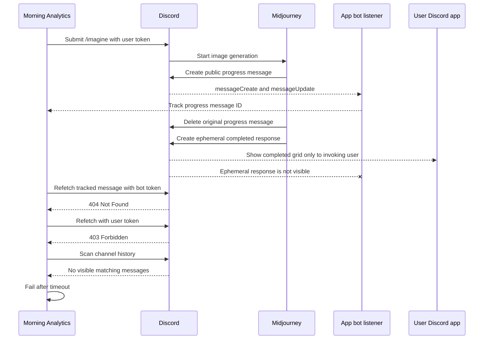
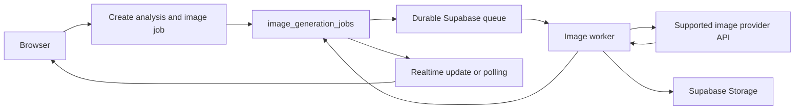
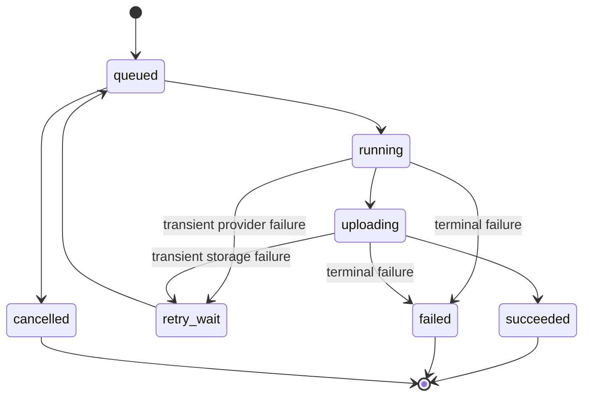
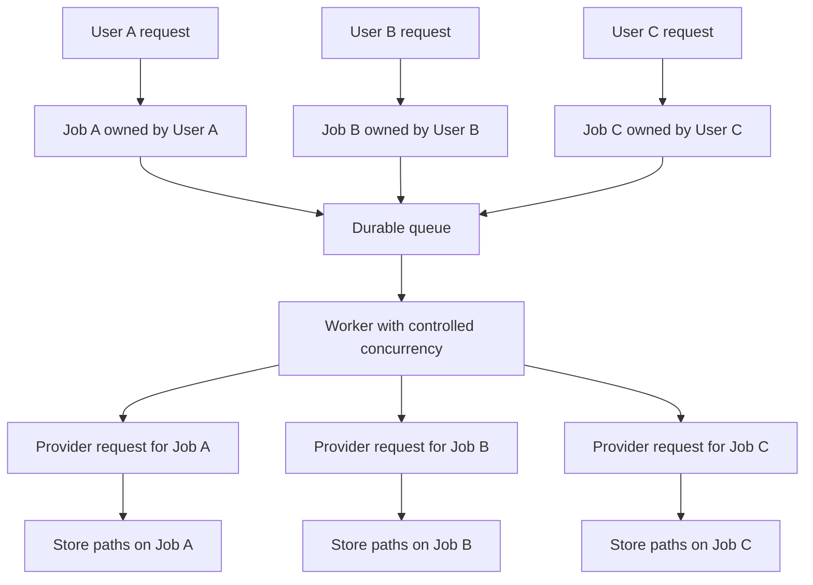
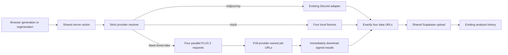
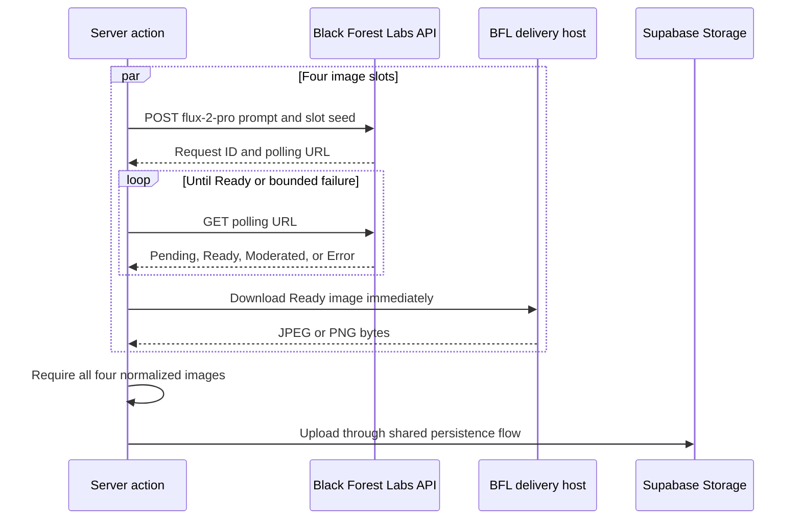

# Image Generation Architecture

This document records the investigation into recurring Midjourney/Discord image-generation failures and the recommended replacement architecture. It exists so future work starts from the evidence and conclusions below instead of reopening the same timeout and message-matching investigations.

## Investigation Conclusion

The recurring failure is not primarily a timeout or prompt-matching problem. In the failing path, Midjourney deletes the public progress message and returns the completed grid as an ephemeral Discord interaction response. Discord shows this to the invoking user as "Only you can see this," but it is not visible to the app's bot gateway or ordinary channel-history API.

No additional wait time, recovery scan, message-ID lookup, prompt matcher, dedicated channel, or Discord bot listener can reliably capture a message that Discord does not expose to that listener.

The recommended direction is therefore:

1. Stop investing in additional Discord/Midjourney listener patches.
2. Replace automated Midjourney generation with a supported image-generation API.
3. Put image generation behind a provider interface and durable job model.
4. Let the browser observe job state instead of waiting inside a long-running server action.

## Evidence

The clearest diagnostic was attempt `d8a0f610-84e4-42bf-94ec-69a9c8f06bcd` on July 11, 2026:

- Discord accepted the `/imagine` interaction immediately.
- The bot listener received a Midjourney `messageCreate`, followed by progress `messageUpdate` events for the same message ID.
- The matching progress message was later deleted.
- Direct recovery with the bot token returned `404 Not Found`.
- Direct recovery with the user token returned `403 Forbidden`.
- Repeated channel-history recovery calls inspected zero messages after the attempt start.
- Discord displayed the completed grid on the user's phone with "Original message was deleted" and "Only you can see this."
- The app timed out only because the successful result was outside every API view available to the current listener.

The common observation that a first generation succeeds while a later generation fails is consistent with Midjourney sometimes producing a normal channel-visible result and sometimes producing this private fallback. The evidence does not explain what causes Midjourney to choose the private path, but the architecture cannot safely depend on that undocumented choice.

## Current Failure Path



## Why the Current Boundary Is Unsuitable

The implementation currently combines two different Discord identities:

- A normal Discord user token submits the Midjourney `/imagine` interaction.
- A Discord bot token listens for channel messages and updates.

This has three fundamental problems:

1. **Visibility:** Discord ephemeral interaction responses are visible only to the invoking user. Retrieving an original interaction response requires the interaction token held by the responding application, which is Midjourney rather than Morning Analytics.
2. **Reliability:** The app correlates asynchronous activity through shared-channel timing, prompt text, message shape, and transient Discord message IDs. These are observations rather than a provider-owned job contract.
3. **Policy:** Discord prohibits automating normal user accounts, and Midjourney's current terms prohibit automated tools from accessing or generating through its service.

Relevant official references:

- [Discord message flags](https://docs.discord.com/developers/resources/message): `EPHEMERAL` messages are visible only to the user who invoked the interaction.
- [Discord interaction responses](https://docs.discord.com/developers/interactions/receiving-and-responding): original and follow-up responses are fetched with the application's interaction token.
- [Discord automated user accounts](https://support.discord.com/hc/en-us/articles/115002192352-Automated-User-Accounts-Self-Bots): automation of normal user accounts outside OAuth2 and bot APIs is prohibited.
- [Midjourney Terms of Service](https://docs.midjourney.com/hc/en-us/articles/32083055291277-Terms-of-Service): automated tools may not access, interact with, or generate assets through the service.

## Options Considered

| Option | Assessment | Conclusion |
| --- | --- | --- |
| Increase the listener timeout | The image is already complete but invisible | Reject |
| Add more prompt or message-shape matching | There is no visible final candidate to match | Reject |
| Refetch deleted messages or scan more history | Deleted and ephemeral responses do not appear in normal channel history | Reject |
| Use a dedicated Discord channel or thread | Improves correlation but not ephemeral-message visibility | Reject |
| Connect an automated user gateway or browser | Might reproduce the phone's view but remains fragile and conflicts with provider policies | Reject |
| Use an unofficial Midjourney API broker | Does not remove policy, account, or upstream behavior risk unless backed by an explicit supported contract | Do not adopt by default |
| Call a supported image API directly | Returns provider-owned responses or job IDs without Discord correlation | Adopt |
| Add durable image jobs around the direct provider | Supports retries, concurrency, refreshes, diagnostics, and multi-user isolation | Adopt |

## Target Architecture



The integration boundary becomes simpler: the worker sends a request directly to a supported provider and receives image data or a provider job ID. Durability is handled inside Morning Analytics, where it can be observed and tested.

Gemini image generation is the first provider to evaluate because the application already uses `@google/genai` and `GEMINI_API_KEY`. Provider choice should still be based on a short quality comparison using representative Morning Analytics prompts. The provider interface should prevent that initial choice from becoming another hard dependency.

## Job Model

An `image_generation_jobs` row should be the source of truth for each generation or regeneration attempt. Likely fields include:

- `id`, `analysis_id`, and `user_id`
- `provider` and `model`
- `prompt` and requested image count
- `status`, attempt count, and retry time
- idempotency key
- completed output count and storage paths
- structured error code and diagnostics
- created, started, completed, and updated timestamps



Each image output should have its own deterministic slot so one failed image can be retried without regenerating successful images. A unique idempotency key should prevent double-clicks or repeated client requests from creating duplicate generation runs.

## Multi-User Behavior



Requests are correlated by internal job IDs rather than prompt similarity. Row Level Security should allow users to observe only their own jobs, while the worker uses server-side credentials to claim work and update results. Controlled worker concurrency protects provider rate limits without forcing one global Discord channel to act as a queue.

Supabase Queues is a suitable initial queue because the project already depends on Supabase and its `pgmq`-based queue provides durable delivery and visibility timeouts. The browser can initially poll the job row or subscribe to Supabase Realtime updates.

## Suggested Delivery Sequence

1. Compare representative prompts across supported image models and select an initial provider/model.
2. Define a provider interface and direct-provider implementation.
3. Add the job table, output-slot model, RLS policies, and idempotency rules.
4. Add a queue consumer or dedicated worker with bounded concurrency and retries.
5. Change generation and regeneration actions to enqueue jobs and return immediately.
6. Update the UI to observe job state and render partial or completed outputs.
7. Remove Discord user-token triggering, bot listening, message recovery, and grid splitting once migration is verified.

## Decision Boundary

If Midjourney's specific aesthetic is non-negotiable, the supported fallback is a manual Midjourney workflow unless Midjourney offers an explicit automation contract. If reliable in-app automation and multi-user operation are required, the app should use a supported direct image API.

The recommended product choice is reliable in-app automation through a supported provider.

## Compatibility Phase: Switchable Providers

The first direct-provider implementation keeps the existing synchronous server-action boundary so Black Forest Labs can be evaluated inside the current app without deleting Midjourney. This is a deliberate compatibility phase, not the durable-job target described above.



Provider selection is immutable for an attempt. `IMAGE_GENERATION_PROVIDER` is the canonical server-side deployment default, while `NEXT_PUBLIC_IMAGE_PROVIDER` remains a temporary compatibility fallback. Test-view overrides require both a public visibility flag and an independent server authorization flag. An error from the selected provider is returned directly; the resolver never invokes another provider as an implicit fallback.

The Black Forest Labs adapter uses the documented EU API by default and pins `flux-2-pro`. It submits four independent jobs concurrently, records deterministic slot seeds, polls each returned URL within a bounded timeout, and immediately downloads each Ready result because delivery URLs are temporary. Polling and delivery URLs are HTTPS allowlisted to BFL public endpoints and returned regional cluster hosts, and are never returned to the browser or retained in diagnostics. The adapter only returns a result when all four images are available.



Validation commands:

```bash
cd app
npm run test:image-providers

cd ../validation
npm run test-black-forest-labs
```

The mocked suite spends no provider credits. The smoke command submits and downloads one 1024x1024 image, writes it to `/private/tmp/black-forest-labs-smoke.jpg`, and does not touch Supabase.
