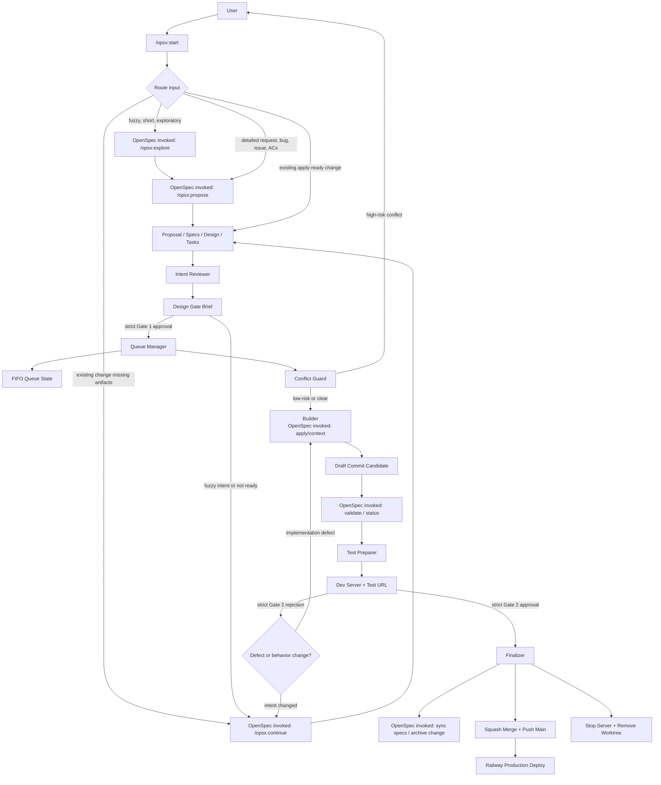

## Context

The current OpenSpec workflow is strong for shaping intent, but delivery still requires the user to serially shepherd a change from rough idea to proposal, design approval, implementation, verification, manual testing, archive, commit, and push. The desired workflow is to spend focused attention on the design and intent, then let approved changes move automatically through background implementation in isolated worktrees until they are ready for manual testing.

This is a local productivity system for a solo project. Railway deploys production when `main` is pushed, so finalization should land approved changes on `main` rather than requiring a PR workflow.

## Goals / Non-Goals

**Goals:**
- Provide `/opsx:start` as the primary user command for moving from idea or existing OpenSpec change to a testable candidate.
- Use explicit OpenSpec commands under the hood: `/opsx:explore`, `/opsx:propose`, and `/opsx:continue`.
- Add two explicit human gates: Design Gate and Manual Test Gate.
- Keep OpenSpec as the source of truth for intent until manual testing passes.
- Keep the user's planning checkout available for the next OpenSpec change while approved work is implemented and finalized elsewhere.
- Run implementation in per-change Git worktrees and branches.
- Allow multiple approved changes to progress in parallel with high-risk conflict detection.
- Produce compact handoffs that include a local test URL.
- Finalize approved changes by archiving OpenSpec, squash merging to `main`, pushing, and cleaning up.

**Non-Goals:**
- Replace OpenSpec with a separate planning system.
- Hide the OpenSpec commands being invoked by the workflow.
- Require PRs for this solo-project workflow.
- Deploy through a new production mechanism; Railway continues to observe `main`.
- Archive OpenSpec before manual testing passes.
- Auto-delete worktrees that may contain unrecovered work.

## Decisions

### Treat OpenSpec as the contract and agents as the scaling layer

OpenSpec remains responsible for the core feature workflow: shaping intent, producing proposal/spec/design/tasks artifacts, guiding implementation through those artifacts, tracking task completion, validating the change, and archiving the finished work. The delivery queue must not replace OpenSpec's design and implementation model.

The agents exist to orchestrate and scale that model:
- keep the user focused on high-value gates
- run approved work in isolated worktrees
- coordinate parallel execution
- detect risky overlap
- prepare manual testing handoffs
- finalize approved candidates consistently

In other words, OpenSpec defines what the change means and what must be true. The agents coordinate when, where, and how approved OpenSpec changes move through local delivery. `/opsx:start` is the harness that makes this feel like one workflow to the user while still invoking the explicit OpenSpec commands at the right moments.



Responsibility split:

| Area | OpenSpec owns | Agents own |
| --- | --- | --- |
| Intake | `/opsx:explore`, `/opsx:propose`, `/opsx:continue` | `/opsx:start` routing and workflow continuity |
| Intent | Proposal, specs, design, tasks | Design Gate Brief summary and risk surfacing |
| Readiness | Artifact status and validation | Human gate enforcement and queue eligibility |
| Implementation | Task contract and context files | Worktree execution and draft commits |
| Parallelism | No direct responsibility | FIFO scheduling, worktree isolation, conflict detection |
| Testing handoff | Manual test focus from artifacts | Dev server, port allocation, compact handoff |
| Completion | Archive semantics and spec sync | Gate 2 finalization, squash merge, push, cleanup |

### Use `/opsx:start` as the primary workflow entrypoint

The normal user path should be one assisted command:

```text
/opsx:start <idea, bug report, issue, or existing change>
```

`/opsx:start` is a harness, not a replacement for OpenSpec. It keeps the workflow moving by routing to explicit OpenSpec commands and then coordinating the delivery queue after the user approves the design.

Routing rules:
- If the input is fuzzy, speculative, very short, or explicitly asks to brainstorm or explore, invoke `/opsx:explore` first, then transition to `/opsx:propose` once the intent is clear enough.
- If the input is detailed, includes acceptance criteria, describes a concrete bug, links or names an issue, or is otherwise implementation-ready, invoke `/opsx:propose`.
- If the user points at an existing active OpenSpec change that is missing required artifacts, invoke `/opsx:continue` until proposal, specs, design, and tasks are apply-ready.
- If the user points at an existing active OpenSpec change that is already apply-ready, read the artifacts directly and create the Design Gate Brief.

The destination is always a Design Gate Brief unless exploration reaches a dead end or the user redirects the work. No queue state should be created before Gate 1 approval.

After strict Gate 1 approval, `/opsx:start` should automatically:
1. Record approval and enqueue the change.
2. Start the next eligible FIFO candidate.
3. Invoke the Builder in the candidate worktree.
4. Run verification and prepare the manual testing handoff.
5. Start the candidate dev server when capacity permits.
6. Present Gate 2 with the server left running and wait for the user's strict approval or rejection.

Parallelism comes from running `/opsx:start` in multiple conversation threads, one change per thread. The lower-level queue commands remain available for recovery, status checks, and advanced operation, but they are not the primary happy path.

### Use a Design Gate Brief as the approval artifact

The system will generate a short Design Gate Brief from the OpenSpec artifacts. The brief is the fast review surface; the full artifacts remain available for deeper inspection.

The brief should fit on roughly one screen and include:
- Intent
- UX or behavior changes
- Scope boundaries
- Key risks and assumptions
- Edge cases worth caring about
- Technical escalations
- Manual test focus
- Ready to build: yes/no, with reason

The system may recommend `Ready to build: yes`, but queue execution requires explicit user approval. This keeps the automation from approving its own understanding.

Gate 1 approval uses strict natural-language interpretation. Clear approvals include phrases such as `approve gate 1`, `approved`, `approved, build it`, `looks good, start building`, `queue it`, and `start the build`. Casual acknowledgements such as `nice`, `ok`, `sounds good`, `interesting`, `continue`, or `maybe` do not approve the gate. Tiny changes still require Gate 1 approval, although the brief can be very short.

### Use explicit agent roles with bounded authority

The delivery queue should define named roles instead of letting each run improvise its own delegation pattern. These roles may be implemented as Codex skills, sub-agent prompts, scripts, or a combination, but their responsibilities and authority should remain stable.

#### Queue Manager

Owns the queue lifecycle. It reads OpenSpec status, manages FIFO scheduling, chooses when to invoke other roles, tracks queue state, and decides whether a change is waiting, active, ready for test, blocked, rejected, or finalized.

Authority:
- May update local queue runtime state.
- May create candidate and landing worktrees and branches through explicit queue workflow commands.
- May interrupt the user only for design ambiguity or high-risk queue conflicts.
- Must not approve either human gate on the user's behalf.

#### Intent Reviewer

Creates the Design Gate Brief and decides whether the system can recommend `Ready to build: yes`.

Authority:
- May read and summarize OpenSpec proposal, specs, design, and tasks.
- May identify missing product behavior, UX ambiguity, scope creep, edge cases, risks, assumptions, and technical escalations.
- May recommend artifact refinement.
- Must not queue implementation without explicit user approval.

#### Conflict Guard

Compares queued and active changes before implementation starts and when changed files become known.

Authority:
- May inspect OpenSpec proposal, specs, design, tasks, branches, and changed files to derive expected touched areas.
- May classify overlap as low-risk or high-risk.
- Must pause or sequence later work when high-risk conflicts are found.

#### Builder

Implements approved changes inside the assigned branch and worktree.

Authority:
- May edit files only inside its assigned worktree.
- May mark OpenSpec tasks complete as implementation progresses.
- May create local draft commits on the change branch.
- Must not edit the main checkout.
- Must not archive, merge to main, push main, or clean up the worktree.
- Must interrupt if implementation reveals design ambiguity.

#### Test Preparer

Runs verification and prepares the manual testing handoff.

Authority:
- May run configured verification commands in the candidate worktree.
- May derive change-specific verification commands from OpenSpec proposal, specs, design, and tasks.
- May allocate a local port and start or stop the candidate dev server within configured capacity.
- May produce the ready-for-test handoff.
- Must not approve Gate 2 or finalize the change.

#### Finalizer

Runs only after the user approves the Manual Test Gate.

Authority:
- May stop the dev server, update the landing `main` worktree when safe, rebase the candidate branch, rerun verification, archive OpenSpec, generate the squash commit message, squash merge to main from the landing worktree, push main, and clean up local queue resources.
- Must pause if the landing worktree has uncommitted changes, if rebase conflicts appear, if verification fails after rebase, or if push fails.
- Must not delete dirty worktrees or branches that contain unfinalized work.

Initial implementation should prefer these roles as deterministic workflow boundaries. Actual parallel sub-agent execution is optional and should be introduced only where it helps, such as running independent Builders or Conflict Guards. The key requirement is role clarity, not maximum agent count.

### Use scripts as the portable source of truth and skills as readable wrappers

Queue behavior should be implemented first as repo-local scripts so the workflow is usable from Codex, Claude Code, Cursor, or a terminal. Tool-specific skills or commands should be thin orchestration wrappers around those scripts.

The canonical `/opsx:start` workflow should live in a portable skill:

```text
.agents/skills/openspec-start/SKILL.md
```

Tool-specific adapters should stay thin and point back to the canonical workflow:

```text
.claude/commands/opsx/start.md
.claude/skills/openspec-start/SKILL.md
.codex/skills/openspec-start/SKILL.md
```

This avoids having different agents invent different delivery semantics. The adapters may translate the trigger syntax for Codex, Claude Code, Cursor, or another assistant, but they should preserve the same gates, routing rules, script calls, and safety boundaries.

Scripts own deterministic operations: queue state transitions, config validation, worktree setup, artifact snapshotting, port/server management, verification commands, finalization, and cleanup. Scripts must not decide whether intent is good enough, approve either human gate, or perform AI implementation. Those judgment-heavy responsibilities stay with the user and the assistant role wrappers.

The portable script entrypoint should expose a stable command surface, for example `node scripts/openspec-queue.mjs <command>`:

| Command | Responsibility |
| --- | --- |
| `status [<change>]` | Show queue state, worktree paths, branch, server, verification, and blocked/ready status. |
| `doctor` | Validate config, git state, worktree state, stale server metadata, port availability, and recoverability. |
| `approve <change>` | Record Gate 1 approval supplied by the user and enqueue the change. It must not decide readiness itself. |
| `start [<change>|--next]` | Start the next FIFO-eligible item or named change by creating/reusing the candidate branch/worktree and snapshotting approved OpenSpec artifacts. |
| `prepare-test <change>` | Run default verification, allocate or reuse a port, start the dev server when capacity permits, and emit the manual testing handoff. |
| `serve <change>` | Start or restart the candidate dev server for a ready candidate. |
| `stop <change>` | Stop the candidate dev server and update local runtime state. |
| `reject <change>` | Record Gate 2 rejection, preserve the worktree, and mark the item for artifact/task refinement and retest. |
| `finalize <change> --confirm-gate2` | Finalize only after explicit Gate 2 approval by stopping the server, using the landing worktree, rebasing when conflict-free, rerunning verification, archiving OpenSpec, squash merging to `main`, pushing, and clearing finalized runtime state. |
| `cleanup <change>` | Remove finalized local resources only when the worktree is clean and the branch has been safely finalized. |
| `recover [<change>]` | Inspect failed or interrupted queue items and print safe recovery actions without destructive changes by default. |

Script commands should support human-readable output by default and machine-readable `--json` output for skills and assistants. Mutating commands should support `--dry-run` where practical. Commands that push, delete, stop servers, or clean up worktrees must be explicit about the state transition they are about to perform.

Each skill or command must be human readable. It should state:
- which role it represents
- which script commands it calls
- why each script is called
- what safety boundary the script enforces
- what output or state transition the user should expect

This keeps automation behavior portable while making assistant-facing workflows understandable and auditable.

### Keep OpenSpec artifacts durable and queue state local

OpenSpec artifacts remain under `openspec/changes/<change>/` and travel with the feature branch. Runtime delivery state should be stored separately from product requirements.

Durable artifacts:
- proposal, specs, design, tasks
- eventual archive under `openspec/changes/archive/`

Shared queue config:
- `.openspec-queue/config.json`
- committed to the repo
- stores portable workflow defaults such as worktree root, landing worktree path, concurrency limits, port start, and branch prefix

Local runtime state:
- `.openspec-queue/state.local.json`
- gitignored
- queue status
- worktree path
- landing worktree path
- branch name
- assigned port
- dev server process details
- last verification result

This avoids polluting specs with machine-specific details while still making the workflow accessible from Codex, Claude Code, Cursor, or other local tools.

### Use one worktree and branch per approved change

Each queued change gets a branch such as `codex/<change-name>` and a worktree outside the main checkout, for example:

```text
/Users/jhartley/code/morning-openspec
/Users/jhartley/code/morning-openspec-worktrees/<change-name>
```

Implementation happens inside the worktree. The branch contains both the OpenSpec change artifacts and code changes so the candidate is self-contained.

After Gate 1 approval, `/opsx:start` hands off to the Queue Manager, which creates a candidate branch/worktree and snapshots the approved OpenSpec artifacts into that branch before the Builder starts. The Builder invokes OpenSpec apply/context from inside the candidate worktree so implementation is based on the same artifact version that was approved.

### Use separate planning, implementation, and landing workspaces

The workflow should not require the user's main planning checkout to stay clean while background work is in progress. The user may continue shaping the next OpenSpec change in `/Users/jhartley/code/morning-openspec` while queued changes run elsewhere.

The queue uses three workspace roles:
- Planning checkout: the user's normal repo checkout for exploration, artifact review, and new OpenSpec changes.
- Implementation worktree: one per approved change, used by the Builder and Test Preparer.
- Landing worktree: a dedicated clean `main` worktree used only by the Finalizer to update from origin, squash merge approved candidates, and push `main`.

The Finalizer must inspect the landing worktree, not the planning checkout, when deciding whether `main` is clean enough to update and push. If the landing worktree is dirty, finalization pauses. If the planning checkout is dirty with unrelated planning work, finalization can continue.

### Create local draft commits before manual testing

Once a candidate is implemented and verification has run, the system creates a local draft commit on the feature branch. Draft commits make worktree state durable, easier to diff, easier to recover, and safer to manage in parallel.

Gate 2 finalization does not preserve draft history. It creates a clean production history by squash merging into `main`.

### Run quiet background execution

Background work should avoid frequent status interruptions. The system interrupts immediately only for:
- design ambiguity discovered during implementation
- high-risk conflict with another active or queued change

Other issues, including build failures, lint failures, missing environment values, rebase conflicts, or long-running implementation, should be fixed where practical and otherwise included in a blocked or ready handoff.

### Use repo-specific default verification

The queue should define a default verification baseline so candidates are not pushed to production on vague "verification passed" claims.

Default automated verification from `app/`:
- `npm run lint`
- `npm run build`
- `npm run check:lockfile-registry` when `app/package-lock.json` changed

The Design Gate Brief supplies the manual test focus for Gate 2. The Test Preparer derives change-specific automated verification from the canonical OpenSpec artifacts and may add commands when a change touches validation scripts, integrations, Supabase behavior, image generation, or AI output parsing.

### Detect high-risk conflicts, not all overlap

Parallel worktrees are useful only if conflict handling is pragmatic. The system should permit low-risk overlap and block or sequence high-risk overlap.

High-risk conflict categories:
- same component behavior
- same server action
- Supabase schema or RLS changes
- package or lockfile dependency changes
- auth/session code
- deployment-sensitive configuration
- same OpenSpec spec capability

Low-risk overlap can be recorded in the handoff without blocking.

### Cap active servers separately from active worktrees

A 16 GB laptop can likely tolerate multiple worktrees, but multiple Next.js dev servers are heavier. The queue should distinguish implemented candidates from running candidates.

Initial defaults:
- active implementation jobs: 2
- running dev servers: 2
- ports allocated from `3001`, `3002`, `3003`, and upward

Candidates beyond the running-server limit remain ready but stopped until the user asks to test them.

### Gate 2 finalization lands on main

At Gate 2, `/opsx:start` leaves the candidate dev server running and waits for strict user approval or rejection. Clear approvals include phrases such as `approve gate 2`, `tested and approved`, `manual test passed`, `finalize it`, `push it`, and `deploy it`. Casual acknowledgements such as `looks ok`, `nice`, `seems fine`, or `continue` do not approve finalization. Clear rejections include phrases such as `reject gate 2`, `manual test failed`, `this is wrong`, `fix this`, `the behavior is not correct`, and `not approved`.

If Gate 2 is rejected because implementation is defective, the system fixes the same worktree, updates tasks as needed, reruns verification, and presents Gate 2 again. If rejection changes intended behavior, the system updates the OpenSpec artifacts first, then fixes the same worktree, reruns verification, and presents Gate 2 again.

After manual test approval, the system:
1. Stops the candidate dev server.
2. Creates or reuses the dedicated landing worktree for `main`.
3. Verifies the landing worktree has no uncommitted changes.
4. Updates landing `main` from origin.
5. Rebases the feature branch onto current `main` if the rebase applies without conflicts.
6. Reruns required verification.
7. Archives the OpenSpec change in the same branch.
8. Generates a final squash commit message from the OpenSpec change.
9. Squash merges into `main` from the landing worktree.
10. Pushes `main`, triggering Railway deployment.
11. Removes the candidate worktree and clears local runtime state.

If the landing worktree has uncommitted changes, the system pauses before updating it. The user's planning checkout does not need to be clean for finalization. If remote `main` moved and the candidate branch rebases cleanly, the system proceeds automatically. If rebase conflicts appear, it pauses and keeps the candidate worktree intact.

## Risks / Trade-offs

- Hidden implementation ambiguity after approval -> interrupt immediately and loop back to artifact refinement.
- Queue state drift after crashes -> use local runtime state plus Git branch/worktree inspection to recover.
- Parallel work creates merge conflicts -> detect high-risk overlap before starting and rebase before finalization.
- Dev servers consume too much memory -> cap running servers separately from ready worktrees.
- Draft commits accidentally land as noisy history -> always squash merge to `main` during Gate 2 finalization.
- Automated finalization could push broken work -> require manual test approval and rerun verification before pushing.
- Worktree cleanup could lose work -> never remove dirty worktrees or branches that have not been finalized.

## Migration Plan

1. Implement the workflow locally behind `/opsx:start` plus explicit lower-level queue commands for recovery and advanced operation.
2. Start with one `/opsx:start` thread and one queued worktree to prove the lifecycle from idea to Gate 2.
3. Enable two active implementation jobs after the single-change path is reliable.
4. Enable multiple running dev servers only after port allocation and cleanup are stable.
5. Keep existing manual OpenSpec commands and queue commands available as fallback.

Rollback is operational: stop using the queue commands, keep or remove existing worktrees manually after checking their status, and continue with the standard OpenSpec workflow.
